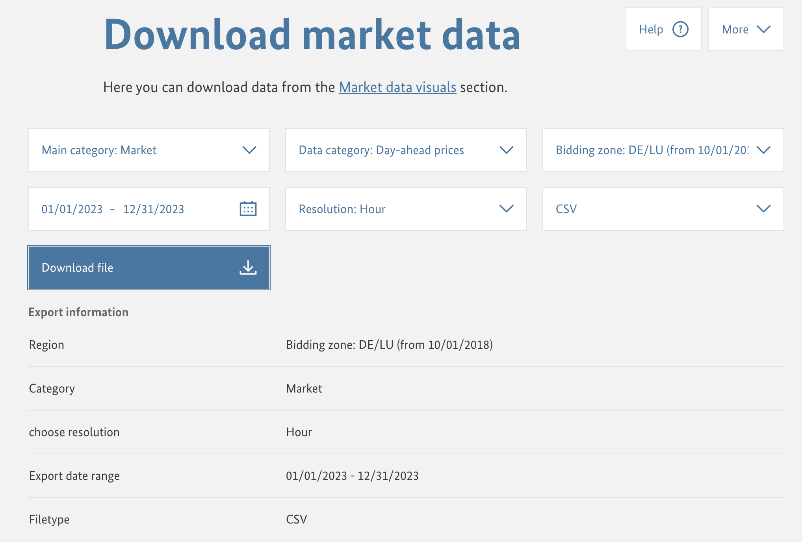
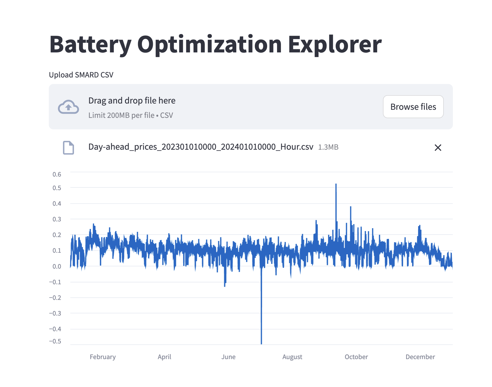
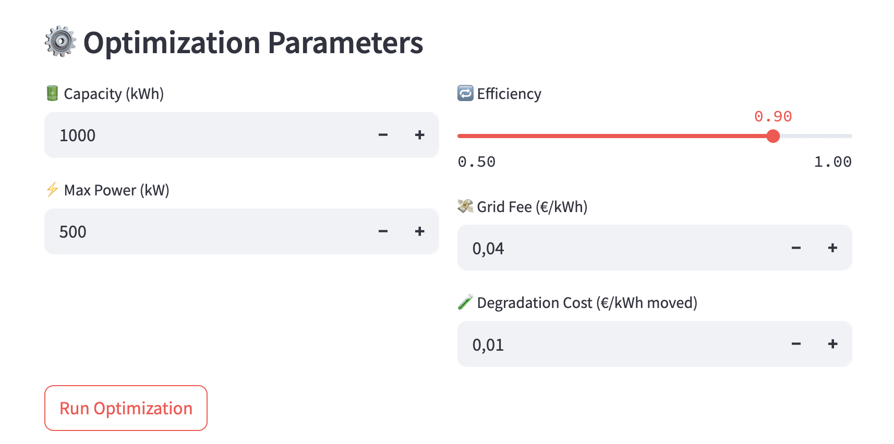
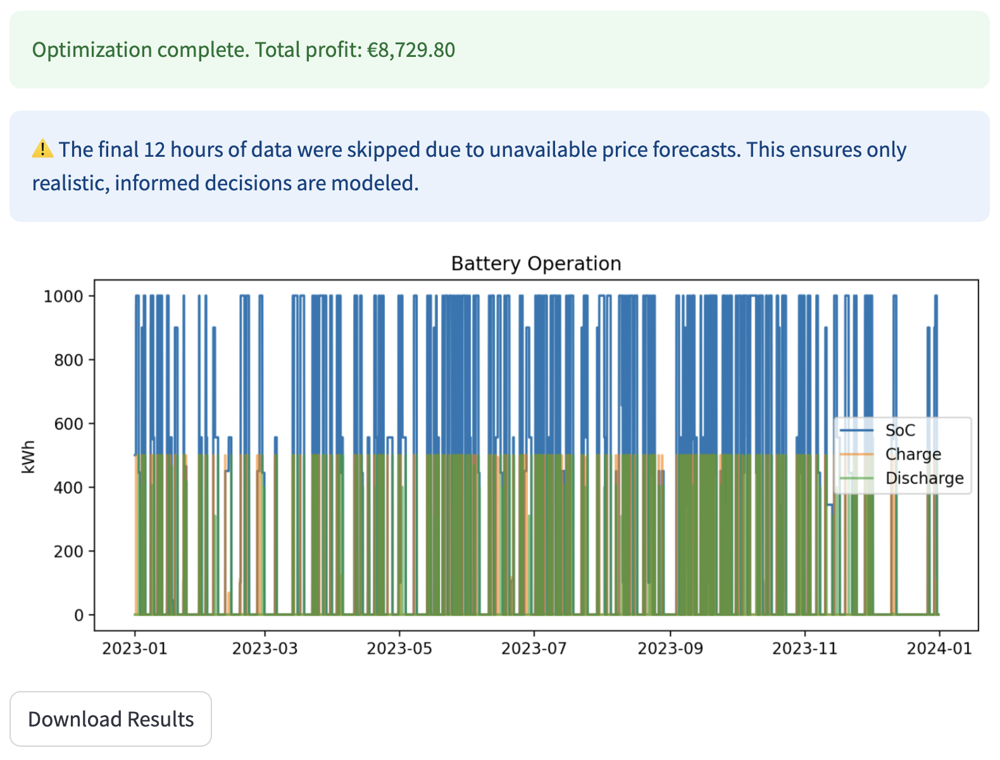

# ⚡ Battery Optimization Explorer

This is a Streamlit web application that simulates and optimizes the operation of a battery energy storage system (BESS) based on day-ahead electricity market prices.

## 🔍 Overview

You manage a battery connected to the electricity grid. Given historical day-ahead market prices (e.g., from SMARD.de as shown in the screenshot below), the app helps determine the optimal charge/discharge schedule over the year to maximize profit — while considering grid fees, round-trip efficiency, and battery degradation costs.



### 📊 App Interface



## 🎯 Features

- 📁 Upload your own [SMARD CSV](https://www.smard.de/en/downloadcenter/download-market-data/) with hourly electricity prices
- ⚙️ Customize battery parameters (capacity, power, efficiency, costs)
- 🧠 Run a rolling optimization using [`cvxpy`](https://www.cvxpy.org/) (free and open-source convex optimization library)
- 📈 Visualize battery charge/discharge behavior and SoC (State of Charge)
- 💾 Export results as a downloadable CSV file.
- 💡 Built with Streamlit for simplicity and interactivity

### ⚙️ App Configuration

Customize how your battery behaves using intuitive sliders and input fields:

- Set the battery’s **energy capacity**, **max power**, and **round-trip efficiency**
- Adjust **grid fee** and **degradation cost**
- Load your own price data and hit *Optimize* to simulate realistic operations




### 📊 Optimization Results

Once the optimization runs, the app displays:

- A **time series chart** of charge, discharge, and state of charge (SoC)
- Summary of total profit
- Option to **download results as CSV**




## 🧰 Installation for Local Development
### 1. Clone the repo

```bash
git clone https://github.com/NoCh-Git/battery-optimizer-app.git
cd battery-optimizer-app
```

### 2. Create a virtual environment (optional but recommended)

```bash
python -m venv .venv
source .venv/bin/activate  # On Windows: .venv\Scripts\activate
```

### 3. Install dependencies

```bash
pip install -r requirements.txt
```

## 🚀 Usage

```bash
streamlit run app.py
```

Once running, if it didn't happen automatically, open `http://localhost:8501` in your browser.

## 📄 CSV Format Requirements

Upload a CSV file downloaded from [SMARD.de](https://www.smard.de/en/downloadcenter/download-market-data/) with the following options:

- **File type:** CSV
- **Category:** Market Data → Day-ahead Prices
- **Region:** Germany/Luxembourg [or any other region you're interested in]
- The CSV should have a `;` delimiter (as SMARD exports by default).

## 📦 File Structure of This Repo

```
battery_optimization_app/
├── app.py               ← Main Streamlit app
├── optimization.py      ← CVXPY-based optimization model
├── utils.py             ← CSV loading and plotting utilities
├── requirements.txt     ← Python dependencies
├── images/               ← Images used in README.md
└── data/                ← Optional inputs to be kept locally (ignored by git).
```

## Some Assumptions in the App
### 📈 Day-Ahead Price Publication (Germany / SMARD)

This app simulates realistic battery behavior by aligning with the actual publication schedule of electricity market prices in Germany.

- 📅 **Day-ahead prices** are published by [EPEX SPOT SE](https://www.epexspot.com/en/market-data/dayaheadauction) (via [SMARD.de](https://www.smard.de/en/downloadcenter/download-market-data/)) every day around **12:45–13:00 CET**.
- 🕛 These prices cover the next **calendar day from 00:00 to 23:00**.
- 📤 Bids are submitted by **12:00 CET**, and market results become available about **45–60 minutes later**.

#### ⏳ How We Simplified and Used That Information for Optimization?

- Between **00:00 and ~13:00**, the system can only "see" prices up to **23:00 on the same day** — meaning the actual forecast horizon shrinks as the day progresses (from 24h at midnight down to ~10h before the new prices are published).

- After ~13:00, the system gains visibility into the next day → enabling a **longer optimization window** of ~11h + 24h = ~35h.

The rolling optimizer in this app adapts accordingly, switching between **§13h and 35h lookahead** depending on the current hour of operation — just like a real energy storage operator would.

### ⏳ Final 12 Hours Skipped

To maintain realism, the **last 12 hours of the dataset are excluded** from optimization.
This ensures that our app's operational decisions are based on more realistic and informed price visibility.

##  Further Development 
This is a hands-on project for a battery optimization app. Feel free to contribute, improve, and expand upon it! 

## Potential Next Steps
- How the inclusion of photovoltaic (PV) generation would change the approach and results.
- How the non-shiftable load would change the approach and results.


## 👩‍💻 Author
Narges Chinichian  
Feel free to reach out for questions, ideas, or collaboration!

## 📄 License
MIT License 
